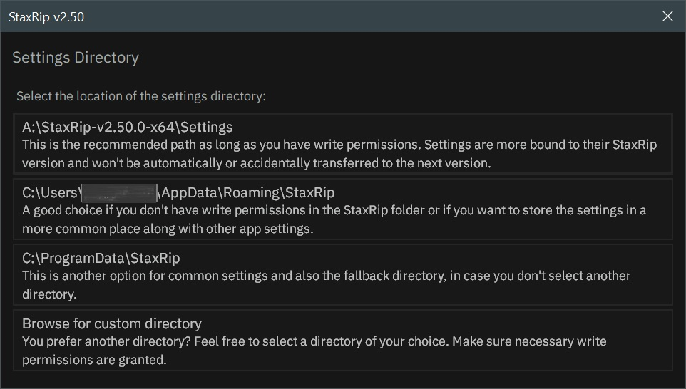
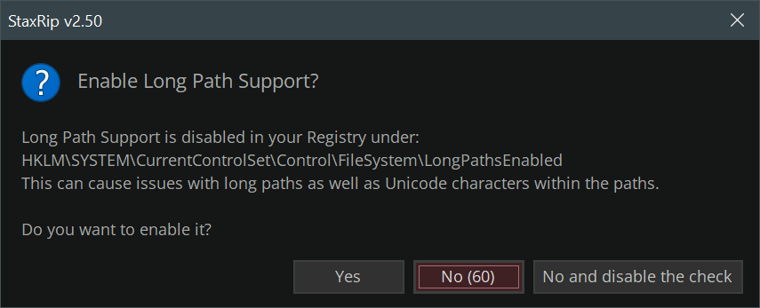
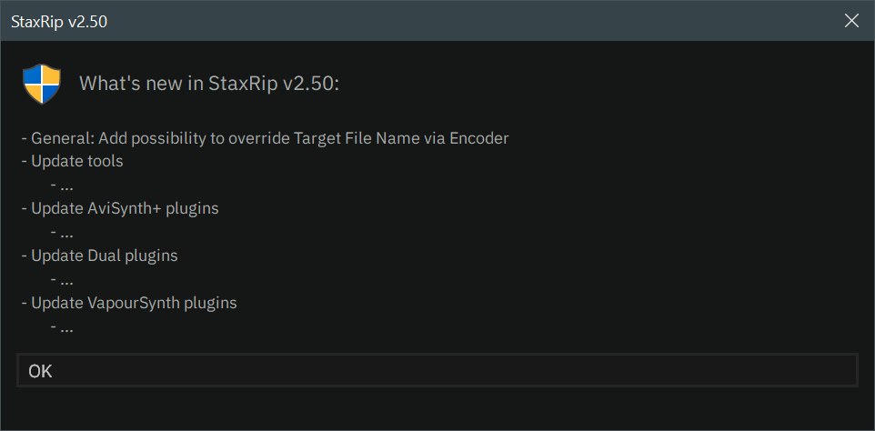
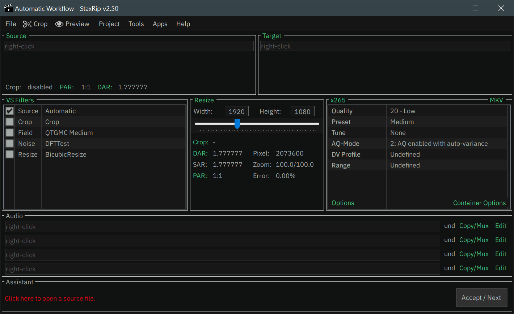

# [Documentation](../README.md) / [Usage](README.md) / First Start

## Installation
StaxRip is written so it can run completely on its own. Nevertheless, some conditions must be met.
Please make sure, that you have followed all steps mentioned in [Installation](../Introduction/Installation.md).

## Settings Directory
When you start StaxRip for the first time a dialog appears, that asks you to chose a location for stored data
like settings, templates, job queue, fonts, etc.:

It is highly recommended to choose the first option. This keeps the stored data next to your instance and you can easily
run different StaxRip versions next to each other.

## Windows 7 Warning
After confirming with the `OK` button, **Windows 7** users will see a warning that let's you know, that 
***Windows 7 is not completely supported*** and that some tools have to be replaced or simply doesn't work.  
For more information: [System Requirements](../Introduction/System-Requirements.md) & [Installation](../Introduction/Installation.md)

## Long Path Support
StaxRip checks (on each startup, in not disabled), if **Long Path Support** is enabled on your system. In case it is not enabled,
a dialog will pop up and ask you, if you want to enable it, which you should accept with a click on `Yes`:

For more Information see: [Long Path Support](Long-Path-Support.md)

## What's New
After your decision the *What's New* dialog appears and shows you the latest changes in the version you are running:

## Let's go
Finally you will see the main window, that you should see directly next time you launch StaxRip
as all decisions have been made and stored:

> [!TIP]
> For a better understanding of what you see, what you can use and most important *how*,
I recommend reading about the [Workflow](Workflow.md) and [User Interface](User-Interface/README.md).