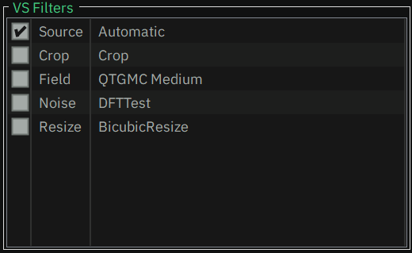

# [Documentation](../../README.md) / [Usage](../README.md) / [User Interface](README.md) / Main Window

- [Main Menu](Main.md#main-menu)
- [Source](Main.md#source)
- [Target](Main.md#target)
- [Filter](Main.md#filter)
- [Resize](Main.md#resize)
- [Encoder/Container](Main.md#encodercontainer)
- [Audio](Main.md#audio)
- [Assistant](Main.md#assistant)

-----

When you start StaxRip, you will see the main window - on your very [first start](../First-Start.md) there
will appear some dialogs beforehand, but you will also end up on the main window:

  

Let's look at each section and see, what we can find there:

## Main Menu

  

### File
- #### Open Video Source File(s)
	Opens a dialog, that gives you the opportunity to open a source file in different ways.  
    For more information check out [Open Video Source File(s)](Opening.md).
- #### Demux
	Demuxes a video file into a specific folder while referring to the [Project Options](Project-Options.md).
- #### Video Comparison
	It's a feature to compare different versions of a video, for example a source and an encode or just a
    AviSynth or VapourSynth script with some filters, that were applied, in order to see and compare the effects.  
    For more information check out [Video Comparison](Video-Comparison.md).
- #### Open Project
	Opens an existing project.
- #### Save Project
	Saves and overwrites the current project.
- #### Save Project As...
	Opens a dialog to let you choose the location and file name of the current project, that is about to be saved.
- #### Save Project As Template
	In case there is no source file loaded yet, you can save the current project as a template,
    so it can be used later again. 
    For more information check out [Save Template](Save-Template.md).
- #### Close Project
	This command closes the current project/template and loads the startup template again.
- #### Project Templates
	The expanding list contains all templates, that are available.
	Subfolders in the Templates folder are represented by submenus.
	Choose one and click on it to load it.
- #### Recent Projects
	Currently the last up to 25 projects, that you have used, are listed here. This gives you the opportunity
	to quickly re-load such a project.  
	The number of listed projects can be adjusted in [Settings](Settings.md#user-interface).
- #### Launch New Instance
	Simply starts a new StaxRip instance.
- #### Exit
	It feels weird to explain this, but it closes StaxRip. :astonished:
	In case the project has not been saved and projects are not [saved automatically](Settings.md#general),
	a dialog will appear to ask you, if you want to save the changes/project - or abort.    

### Crop
Opens the [Crop](Crop.md) window, where you can crop the source in case you want to remove black bars or any other
unwanted parts on the sides.

### Preview
Opens the [Preview](Preview.md) window, where you can see the results of your filters and settings, that are used
to feed the video encoder. It is also used to cut the video.

### Project
- #### Add Hardcoded Subtitle  
	Opens a file dialog, where you can choose a subtitle file, that it then used to set a new filter with it.  
	> :information_source: Due to special needs this command is not a regular filter profile.
- #### Script Info  
	Just a short overview about your resulting script.  
	> :information_source: This is the same information the [Preview](Preview.md) windows shows.
- #### Advanced Script Info  
	In case you want or need more information, you can select between multiple options, that provide those data.
	Depending on the [Frame Server](../Frame-Servers.md) you use, different options appear,
	that provide different information.
- #### Log File  
	Opens the current log file within the [Log File Viewer](Log-File-Viewer.md).  
	In case there is no current log file, mostly before a source is opened, the `Log Files` folder with
	all recent log files is opened.
- #### Folders
	Lists project related folders, that you can open from there.  
	> :information_source: They mostly work only if a source file is loaded.
- #### Options
	Opens the [Project Options](Project-Options.md), where you can make project related settings.  
	> :information_source: In case no source file is loaded, these options will be used and saved for/with the template.

### Tools
- #### Jobs
	This opens the [Jobs](Jobs.md), where your planned jobs are listed. From there you can have a look, move the jobs,
	deactivate them and most important: You can also **start** the encodings.
- #### Folders
	Lists StaxRip related folders like the `Settings` folder, that you can open from there.
- #### Scripts
	At the top there are all the PowerShell scripts in your `Settings\Scripts` folder, that you can execute from there.
	At the bottom you can click on `Open Script Folder` to open that folder.
- #### Advanced
	- ##### Event Commands
    	Opens the [Event Commands](Event-Commands.md) dialog, where you can alter the events.
	- ##### Reset Settings
    	Opens a dialog allowing you to reset specific settings.
	- ##### Command Prompt
    	Opens a Command Prompt session window with additional and/or extended environment variables.
	- ##### PowerShell Terminal
    	Opens a PowerShell session window with additional and/or extended environment variables.
	- ##### Windows Terminal
		Opens a Windows Terminal session window with additional and/or extended environment variables.  
		> :information_source: Only visible, if Windows Terminal was found on your system.

- #### Edit Menu
	Opens the [Menu Editor](Menu-Editor.md), which you can use to customize the Main Menu.
- #### Settings
	Opens the [Settings](Settings.md), which contains all global options for StaxRip.

### Apps
The first part of the menu lists categorized apps, that are mostly included and ready to be used.  
At the bottom you can click on `Manage` to open the [Apps Manager](Apps-Manager.md).
There you can check all used apps and plugins with all their information.

### Help
Many help related entries, that might help you in some cases.

## Source

The Source section is on the upper left side and it contains the path of the source file as well as some information about it,
like its length, size, bitrate, framerate, resolution and so on.

With a right-click on the source file text field you can open a menu for some additional functions:

  

- #### Open
    Opens the [Open Video Source File(s)](Opening.md) dialog to select a source file.
- #### Play
    Plays the source file with `mpv.net`.
- #### Media Info
    Opens `MediaInfo.NET` to show you deeper information about the selected source file. This can be useful
- #### Explore
    Opens the folder, that contains the source file.
- #### Copy / Paste
    What could it be...

## Target

The Target section is on the upper right side and it contains the path of the target file as well as some information about it,
like its length, resolution, framerate and the bitrate of all audio tracks.
These data is based on the outcome of the [Frame Servers](../Frame-Servers.md),
so after the [filters](Main.md#filter) are applied.

> :warning: It's important to note, that these information show the state before the script data is passed to the encoder.  
> So the final result can be different depending on the encoder settings.

With a right-click on the target file text field you can open a menu for some additional functions,
that are almost identical to those from the [Source](Main.md#source) section.

## Filter

The filter section is one of the most important parts of StaxRip. At the top you can see which type of filters is used,
so either `AVS Filters` or `VS Filters`, indicating the usage of `AviSynth+` or `VapourSynth`.  
For more details on that check out [Frame Servers](../Frame-Servers.md).

Below all filters, that are set up, are listed.
On the left there is a checkbox for each filter, so you can enable and disable it quickly.
Next to the checkbox there is the name of the category and then the name of the filter itself.

> :warning: The order is very important as all calls are executed in that order.

> :information_source: The first filter has to be the `Source` filter.  
:information_source: The second one should be the `Crop` filter unless you have good reasons to put something in between them.

  

Filters can be moved via drag&drop easily, in case you have to change the order.  
With a double-click on the list you can open the [Code Editor](Code-Editor.md) directly.  
A right-click on a specific filter open an item related context menu:

  

- #### *Selected filter category*
    The first entry is always the selected filter category, for example *Noise*.  
    This way you can select a different filter of that particular category, which might be useful if you want to try out
    different denoisers, sharpeners or something like that.
- #### Replace
    Replaces the selected filter with the one you choose.
- #### Insert
    Inserts the chosen filter at that exact place - in other words: **before** the selected filter.
- #### Add
    Adds the chosen filter at the bottom end.
- #### Remove
    Removes the selected filter.
- #### Edit Code
    Opens the [Code Editor](Code-Editor.md) to modify the filters.
- #### Preview Code
    Show the resulting script of your setup.
    All macros and values are placed in and all loaded dependencies are included as well. 
    This is the script, that is used to feed the encoder.
- #### Info
    Shows some basic information about the resulting video like resolution, framerate and duration.
    > :information_source: This is the same information you get on the [Preview](Preview.md).
- #### Play
    Plays the resulting script with `mpv.net`.
- #### Profiles
    Opens the [Filter Profiles window](Filter-Profiles.md), where you can alter and reset the profiles,
    that then can be used to be added to the list of filters.  
    For more information about its handling check out [Filter Profiles](../Filter-Profiles.md).
- #### Move Up/Down
    Obviously to change the order of filters.

    > :warning: Like mentioned above, the order is very important for the processing and outcome.  

    > :information_source: Using drag&drop is easier and faster.  
- #### Filter Setup
    - ##### AviSynth
        Sets **AviSynth+** as the current to use [Frame Server](../Frame-Servers.md).
    - ##### VapourSynth
        Sets **VapourSynth** as the current to use [Frame Server](../Frame-Servers.md).
    - ##### Edit Profiles
        Opens a dialog, that lets you edit, copy, remove, etc. filter setups.  
        > :information_source: Even though they can be useful in some cases,
		you should consider creating a template instead.

## Resize

The resize section gives you the opportunity to resize the given video pretty easy. To do so you can choose between
(custom) pre-defined resolutions as well as a slider.

A click on `Resize` at the upper left opens a menu with a bunch of pre-defined resolutions to choose from. Via `Edit Menu`
you can open the Editor to customize those values.

Below the actual resolution is shown, separated in `Width` and `Height`. In case the `Resize` filter is active,
you can use the `up`/`down` keys or the mouse wheel to increment/decrement the values by the set `Output Mod` value
in [Project Options](Project-Options.md), by default `2`.  
Alternatively you can move the slider below to adjust the resolution.

Then you get some information about the target image/video:

- #### Crop
    The crop values, set by hand via [Crop](Crop.md) or by `Auto Crop`.  
    For more information check out [Cropping](../Cropping.md).
- #### DAR
    Display Acpect Ratio.
- #### SAR
    Storage Acpect Ratio.
- #### PAR
    Pixel Acpect Ratio.
- #### Pixel
    Calculated number of pixels.
- #### Zoom
    Zoom factor in percent indicating the relation of size between the source and the target image.
- #### Error
    Aspect Ratio Error.

  

## Encoder/Container

This panel comes in 2 outfits: A more complex variant, that let's you see/check and set certain parameters (see left image),
and a basic panel with two options to open the [Encoder Options](Encoder-Options.md) as well the [Container Options](Container-Options.md).  

    

What both have in common is a button on the upper left side, that shows the name of the current selected encoder.
When you click on it, you get a context menu, where you can choose all encoder profiles from.  
In the upper right corner there is another button, indicating the file extension of the target file.
This is `MKV` or `MP4` in most cases, but can be something else, especially when `No Muxing` is selected.  
By clicking on `Edit Profiles...` you can open a dialog,
where you can edit these lists as well as the encoder/muxer themselves.

  

So let's go back and concentrate on the more advanced variant (left image):  
At the bottom left there is a button saying `Options`, where you can open the [Encoder Options](Encoder-Options.md) and
at the bottom right there is one saying `Container Options`, where you open the [Container Options](Container-Options.md).  
In between a button saying `Target Name Override` indicates whether the [Override Target File Name](Encoder-Options.md)
feature is enabled or not. By clicking on it you can toggle its status.

## Audio

Each row represents one audio track. The text field contains the stream or file name of the source.
Right next to it, a label is showing the name of the language, that is assigned to that audio track.  
Next to the language name is a button with the name of the current set audio profile.
When clicked on it a menu with all available audio profiles opens and by clicking on `Edit Profiles...` you can open a dialog,
where you can edit this list as well as the audio profiles themselves.  
At the very right an `Edit` button lets you open and edit the current audio profile.

> :information_source: The profile `No Audio` lets the audio track being ignored and not muxed to the final result.  
> :information_source: The number of available audio tracks is optional and can be set in [Project Options](Project-Options.md).

> [!NOTE]
> TODO: How are the tracks filled? Menus?

  

> [!NOTE]
> TODO: Right-Click-Menu

  

## Assistant

The Assistant is there to provide information about the current project status,
including script errors, possible inconsistencies and warnings as well as configuration errors.

In case of a warning or error, you can mostly click on the message to get more information or
open the window, in which the configuration causes issues.
In many cases buttons or labels in regard will be highlighted nayways.

At the very right there is a button to accept warnings in case there is one and
to add the current project as a job to the queue. 
With a right-click you can open a context menu that offers you the possibility to add the job at the bottom/top
as well as with or without opening the [Jobs](Jobs.md).  
For quick usage you can use the CTRL and SHIFT keys instead.
The default behavior can be configured via [Settings](Settings.md#user-interface).

  
