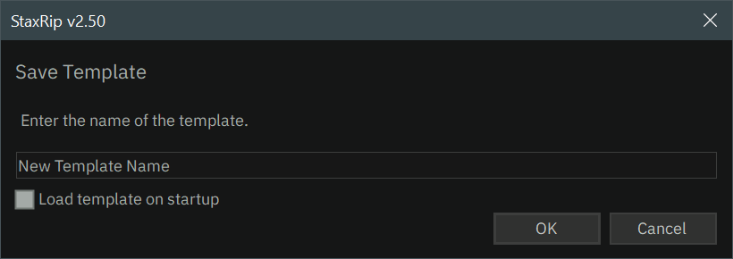

# [Documentation](../../README.md) / [Usage](../README.md) / [User Interface](README.md) / Save Template

:x: :x: :x: 

> [!NOTE]
> Currently this dialog does not support the saving into subfolders, whereas subfolders are supported in general
> when it comes to representation and opening, for example via the [Template Selection](Template-Selection.md)

  

