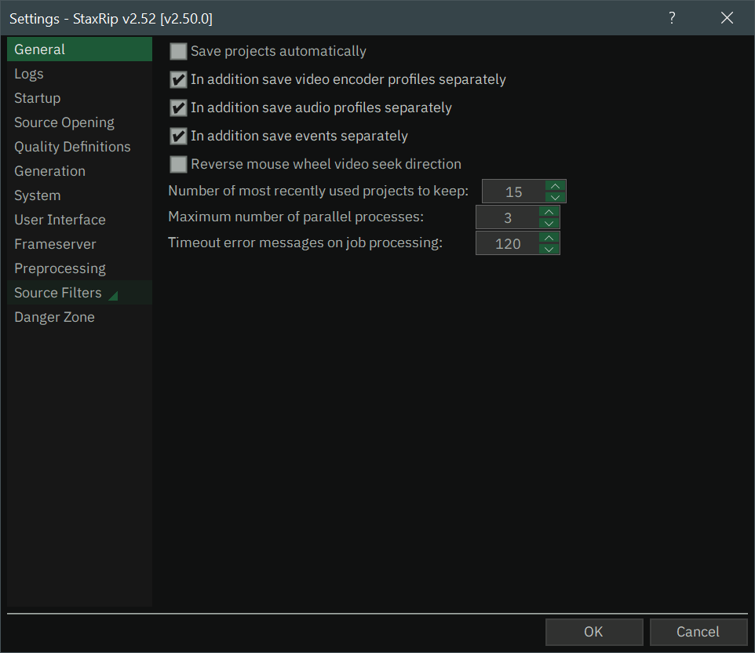
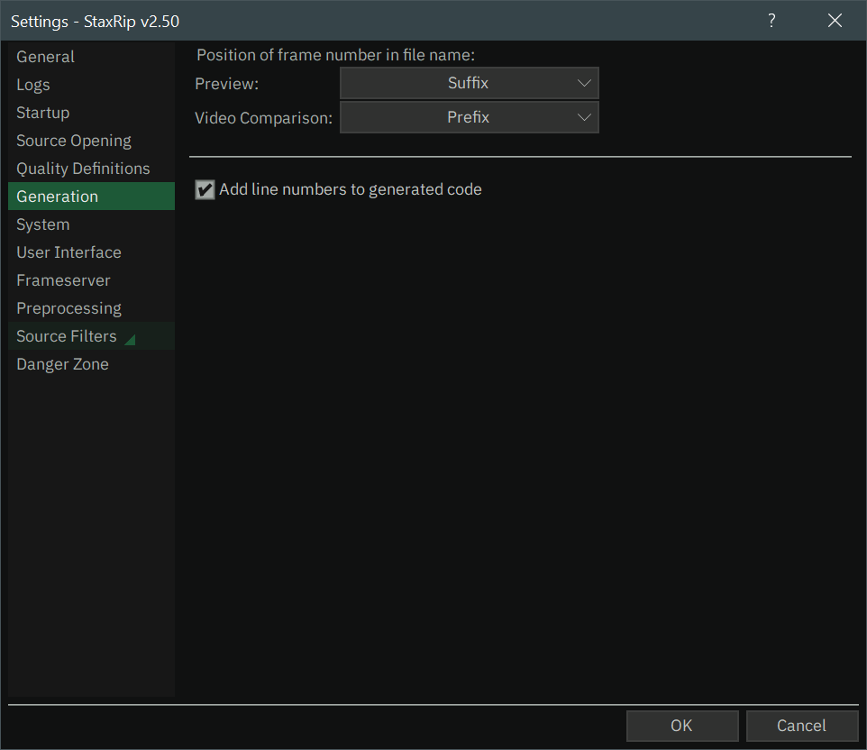

# [Documentation](../../README.md) / [Usage](../README.md) / [User Interface](README.md) / Settings

Via the [main menu](Main.md#main-menu) `Tools » Settings` or by pressing `F10` you can open the Settings.
There you will find everything, that is globally relevant, means not bound to a specific template or project.

## General

  

- **Save projects automatically**  
Whenever a project is modified and an action is performed, that will close the current project, 
StaxRip will ask you, if you want to save the latest changes so they don't get lost.
With this option enabled StaxRip will automatically save the project and don't bother you.  
:warning: ***They will always overwrite the last configuration, even if you just want to test something out. So be careful!***
- **Reverse mouse wheel video seek direction**  
- **Number of most recently used projects to keep**
- **Maximum number of parallel processes**
- **Timeout error messages on job processing**

## Logs

  

## Startup

  

## Source Opening

  

## Quality Definitions

  

## Generation

  

## System

  

## User Interface

  

## Frameserver

  

## Preprocessing

  

## Source Filters

  

## Danger Zone

  
