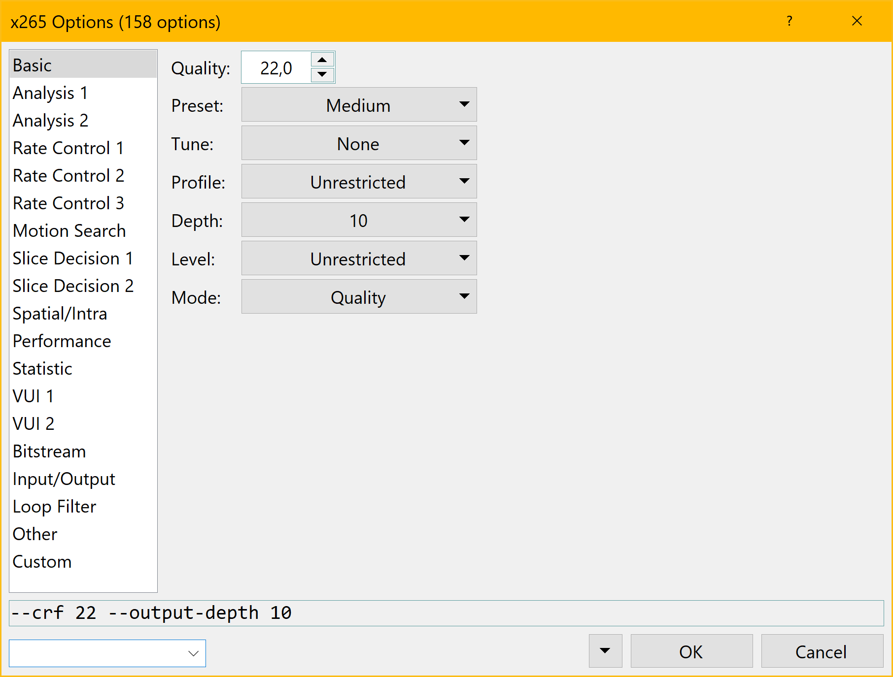

## About

staxrip is a multiformat video encoding application for Windows. It's a GUI frontend to processing tools such as mp4box, mkvtoolnix, avisynth, vapoursynth, x264, x265, nvenc, eac3to and many more.

## Features

- Supports all popular formats and tools
- Hardware encoding for AMD, Intel and NVIDIA
- Batch Processing
- AviSynth and VapourSynth code editor
- Extendable via PowerShell, .NET and COM+
- Minimal user interaction required due to rich configuration and automation features
- copy modes for audio and video for plain remuxing
- Cut/Trim/Edit feature, for MKV output no re-encoding required
- Aiming for perfect High DPI scaling 

## Requirements

- Windows 7 x64 or Windows 10 x64
- [.NET 4.7 or higher](https://www.microsoft.com/en-us/download/details.aspx?id=49981)
- [Intel Skylake](https://en.wikipedia.org/wiki/Skylake_%28microarchitecture%29) or newer for HEVC/H.265 hardware encoding
- [NVIDIA Maxwell gen2 card](https://en.wikipedia.org/wiki/Maxwell_%28microarchitecture%29#Second_generation_Maxwell_.28GM20x.29) or newer for HEVC/H.265 hardware encoding
- [AMD Polaris card](http://www.amd.com/en-gb/innovations/software-technologies/radeon-polaris) or newer for HEVC/H.265 hardware encoding
- AviSynth+ x64, the installer is bundled with StaxRip x64 or alternativly VapourSynth x64 which requires Python x64

## Documentation

https://stax76.gitbooks.io/staxrip-handbook/content/

## License

Licensed under the [MIT license](LICENSE.TXT).

## Download

https://github.com/stax76/staxrip/releases

https://github.com/stax76/staxrip/blob/master/md/test-build.md

## Screenshots

### Main Window

[](https://github.com/stax76/staxrip/blob/master/Screenshots/1.png)

### x265 Encoder Options

[](https://github.com/stax76/staxrip/blob/master/Screenshots/2.png)

### NVIDIA Encoder Options

[](https://github.com/stax76/staxrip/blob/master/Screenshots/3.png)

### Audio Encoding Options

[](https://github.com/stax76/staxrip/blob/master/Screenshots/4.png)

## Scripting

StaxRip can be automated via PowerShell scripting. There are two example scripts included, they can be found at:

Main Menu > Tools > Scripts > Open Scripts Folder

### Scripting Events

In order to run scripts on certain events read the help at:

Main Menu > Help > Scripting

### Scripting Support

If you have questions feel free to ask here: https://github.com/stax76/staxrip/issues/200

### Scripting Examples

Sets a deinterlace filter if the MediaInfo property 'ScanType' returns 'Interlaced':

```
# active project
$p = [ShortcutModule]::p

#global object with miscelenius stuff
$g = [ShortcutModule]::g

if ([MediaInfo]::GetVideo($p.FirstOriginalSourceFile, "ScanType") -eq "Interlaced")
{
    $p.Script.SetFilter("yadifmod2", "Field", "yadifmod2()")
}
```