# Encoding with StaxRip

**S**taxRip is our graphical frontend of choice. The program puts a lot of emphasis on automation, but still offers a full feature set with extensive manual intervention options for the professionals. This concept works very well. In my opinion, StaxRip has by far the best usability among the major encoding front-ends.

StaxRip naturally supports modern encoding methods around MP4, MKV, AAC, x264 and x265 CLI. The source material is also far from being limited to DVD, but includes the usual HD formats as well.

We can save a lot of the manual work from the manual work chapter if we use StaxRip. DVDs and Blu-rays we still rip to disk ourselves; and taking care of subtitles manually is useful to avoid unintentionally losing forced subtitles. Otherwise, StaxRip takes care of the whole process from preparing the video to encoding and muxing.

## Requirements

**S**taxRip has two important requirements:

- a 64bit-Windows,

- the .NET Framework 4.8. In most cases, this should already be installed via Windows Update. If not, there is also an official download from Microsoft

# Set up StaxRip

**F**or the configuration of StaxRip we should take a little time. Although we usually get a message about missing settings automatically and then land in the appropriate dialog box, but this tends to lead to the fact that you have to confirm a whole series of messages and click through dialogs before starting the first encodings. Of course, those who are more comfortable with this are welcome to handle it that way.

At the very first program start StaxRip asks where it should store its configuration files. We choose the option that has **AppData\Roaming** in its name. In the Windows world, this is the default folder for user-specific program settings.

The configuration of StaxRip takes place on two levels. On the one hand there are the project options, which refer only to the current encoding project, on the other hand there are global options, which apply to StaxRip as a whole and thus to all projects.

## Project options

**W**e get to the project options via **Options** in the menu bar or with the **F8** key. We now build a default configuration, which we save and load automatically every time we start StaxRip.

Let's go to the **Image** page.

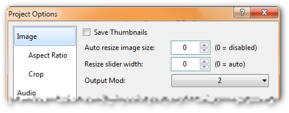

**Output mod** sets the mod value that the final cropped and possibly scaled image must adhere to. There is little to be said against setting the minimum requirement to **2**, i.e. the height and width must each be evenly divisible by 2. A stricter value is only necessary if our playback device cannot handle mod-2. Then **16** is the best choice for maximum compatibility.

**Auto resize image size** automatically sets a target resolution that has approximately the specified number of pixels when the source video is opened. Except for prehistoric 1-CD or 2-CD encodings, this is not useful. Therefore, we leave the option set to **0 = disabled**.

Continue on to the **Aspect-Ratio** page.

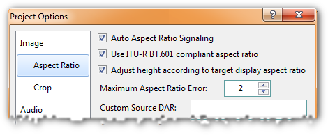

If we have anamorphic encoding in mind, **Auto aspect ratio signaling** is important. This option automatically configures the encoder and muxer so that both write the necessary AR flag to the video stream or container. Therefore, we should definitely leave it enabled. On encodings with square pixels this option has no decisive effect.

Also **Use ITU-R BT.601** is only interesting for anamorphic encodings. We leave the checkmark set so that StaxRip uses the MPEG-4 standard for aspect ratio calculation.

With the **Maximum aspect ratio error** we define how large the maximum percentage aspect ratio error may become before StaxRip warns. We can leave the default 2% as it is.

The **Crop** page remains to complete the configuration for the video image.

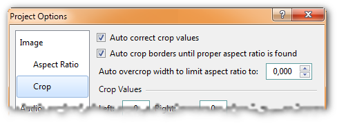

**Auto correct crop values** ensures that the restrictions of the used color space are respected when cropping. Since we rarely encounter anything other than YV12, this means that all crop values can only be even numbers.

By checking **Auto crop borders**, we make StaxRip automatically crop the image when we open a source file. This is quite useful, even if we later check to make sure that all black bars have indeed been removed.

**I**n the Subtitles section we configure StaxRip's subtitle automation.

Under **Auto load subtitles** are the languages that are automatically extracted from the source and included in the encoding. We specify the languages in short form and separated by commas. The abbreviations are the internationally standardized two- and three-letter abbreviations according to [ISO-639-1 and ISO-639-2](https://www.loc.gov/standards/iso639-2/php/code_list.php). There is one exception that is not included in the ISO list: subtitles that do not have a language assigned to them are identified by the abbreviations **und** (undetermined) and **iv**.

**Convert Sup to Sub** automatically converts Blu-ray PGS to Vobsub. Since vobsubs have really lousy quality, this is only useful to support a PGS-incompatible player.

**O**n all other pages we can use the default settings.

A click on **OK** brings us back to the main window. To avoid having to repeat the settings for each encoding, we save the current project as a template via **Project > Save as Template** and check **Load template on startup** in the **Save Template** dialog.

## Global options

**T**he program-wide configuration applies independently of the project and is saved automatically. Therefore we need the menu item **Tools > Settings** ideally only once directly after the StaxRip installation.

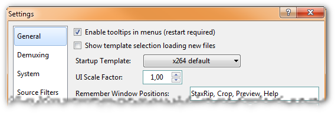

On the **General** page, under **Startup Template**, we can set the project options template that will be loaded when StaxRip starts. There is already the template we just saved.

For those who work with many different configurations, **Show template selection when loading new files** is interesting. If this option is active, StaxRip shows the selection dialog for the project templates when we load a new source.

## External programs

**T**he **Settings** window is now closed. It remains to look into the configuration of the external tools. There is a whole list of them, because after all StaxRip does not do the encoding itself, but only controls the bunch of programs that are responsible for the actual work. Via **Tools > Applications** we reach the appropriate window.

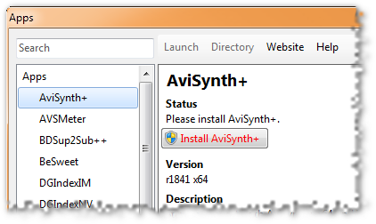

On the left side we see a tree view of all tools StaxRip can work with. On the right, information about the currently selected tool is displayed. The StaxRip download package contains most of the tools, so missing programs are usually not a problem.

If during the configuration of an encoding StaxRip detects that a necessary program is not present, the **Apps** window will automatically open on the appropriate page. There we have the possibility to download the program or - as shown in the screenshot - to install it right away.

All tools that StaxRip comes with are located in the *Apps* subfolder of the StaxRip directory. We should not replace these programs manually without a watertight reason, but wait for the next StaxRip version for updates. This is because StaxRip is extremely picky about program versions. If the installed version does not correspond exactly to the one listed under **Version**, the tool is marked as possibly incompatible as a precaution.

**S**taxRip is now fully configured and we can start encoding with confidence.

# Load source

**A**s the first step on the way to the finished movie file, we load the source video. This analyzes the video and extracts audio and subtitle tracks as needed.

*StaxRip recommends MakeMKV to rip Blu-rays and DVDs to disk. Since this tool can remove playback locks, censorship strikes once again. MakeMKV may or may not be the most sensible solution. I can't say anything about it, unfortunately.*

To load the source video, we click on the **Source** link in the top left corner of the main StaxRip window or double-click in the input field below it.

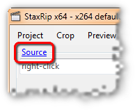

Which option we choose in the following dialog box depends on the type of source.

## Single source file

**T**here are countless situations where we want to process a single source file. It can be a disc ripped to Matroska, an MPEG transport stream of the TV recording, an MP4 downloaded from Youtube, etc.

We select **Single File** in the Source Open dialog and pick the file in the following dialog.

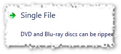

Alternatively, we can drag the file from the file manager into the main StaxRip window. Both methods will then open the source filter selection dialog.

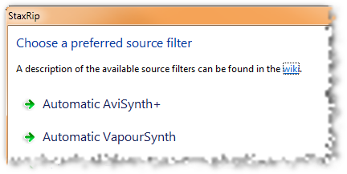

For most encodings, **Automatic AviSynth+** is a good choice. This gives us a very reliable source filter, and if necessary, the full range of AviSynth scripting and filtering is available.

The **Demuxing** dialog follows, where we select which audio and subtitle tracks we want to demux from the source file and process further. With a click on **OK** StaxRip starts to analyze and disassemble the source. This can take a few minutes. Afterwards we end up in the automatically preconfigured StaxRip main window.

## DVD-Rip as VOBs

**A** classic DVD rip works as described in the ripping chapter: We copy the main movie to the disk as a series of VOB files. Then we index the video with DGIndex and extract the audio tracks. However, since StaxRip relies entirely on 64bit software, we cannot use DGIndex because there is no 64bit source filter for it.

StaxRip can still handle main movie VOBs. To do this, we select **Merge Files** in the Source Open dialog.

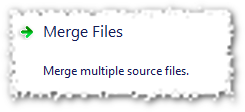

In the following **Merge** dialog we load all VOBs of the main movie via the **Add** button. If we add all VOBs at once, StaxRip will sort them alphabetically. With the **Up** and **Down** buttons we can adjust the order if necessary.

Alternatively, we can avoid the cascade of dialog boxes by selecting all the necessary VOB files in the file manager and dragging them to the StaxRip main window.

With both methods the selection dialog for the source filter opens afterwards, as described above for loading a single file. After we confirm that, StaxRip works for a few minutes to extract video, audio and subtitles from the VOBs. After that we end up in the automatically preconfigured StaxRip main window.

## Blu-ray directly from the disc

**S**taxRip can process Blu-rays directly from the disc, as long as no playback lock interferes. The same applies if the Blu-ray is already on the disc as a 1:1 copy.

We then select **Blu-ray Folder** in the Open Source dialog. Then we pick the Blu-ray drive or folder with the copied disc. StaxRip now starts eac3to analyze the disc. This may take a moment, then a dialog box appears where we select the playlist of the main movie.

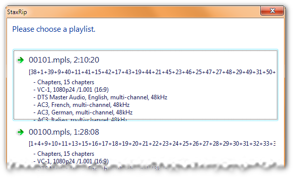

The playlists are sorted by length. How we reliably recognize the entry for the main movie is in the [Manual part for Blu-ray demuxing](https://encodingwissen.de/praxis/handarbeit/quelle/blu-ray-demuxing/#bluray-hauptfilm-heraussuchen).

By clicking on the main movie list we start the second, more detailed analysis run. Depending on the disc, this may take a minute. StaxRip shows the next configuration window right away, but the progress bar in the title bar likes to wait a bit. So be patient: StaxRip did not crash. After the end of the analysis we set everything necessary for demuxing.

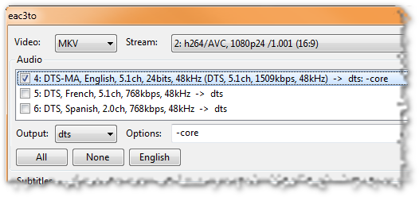

We always demux the video to **MKV**, because it is the best way to continue working with it. If the playlist contains several variants of the video (most different resolutions), we select the appropriate one in **Stream**. In the **Audio** section we check all the audio tracks we need and set the way we want to demux each of them. StaxRip automatically selects the options so that they are actually only extracted and not immediately re-encoded.

In the case of DTS Master Audio, we may need to do some hand-coding. The full lossless track is huge and offers no audible difference in quality from the DTS core it contains, which is a normal 5.1 DTS track. We might have to give up two channels (7.1 vs. 5.1), but that only matters in a professionally equipped home theater - well, professional in the sense of having your own cinema room. Therefore it is often useful to set DTS-MA to **dts** under **Output**. StaxRip then automatically adds the option 'core' under Options to extract only the DTS core. If you want to have the full track, set it to **dtsma** under **Options**.

Then we turn to the lower part of the window.

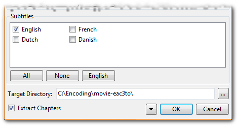

In the **Subtitles** section we check the required subtitle tracks. In order not to forget any forced subtitles, it is best to extract all tracks of all necessary languages. We decide later which of them we actually want to have in the final encoding.

StaxRip saves the created single tracks in the folder specified under **Target Directory**. We still have to check **Extract Chapters** to save the chapters list. Then we start the demuxing with a click on **OK**. Put on coffee if you work directly from the disc! Because it can take half an hour to shovel 20 to 25 GB of data onto the hard disk.

## Check loaded source

**I**t doesn't matter if it's a DVD, Blu-ray or any other video: When the loading is done, the Source section of the StaxRip window will show the name of the source file and the key data of the movie.

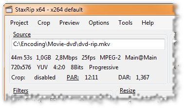

Under **Crop** we see the automatically cropped resolution; of course, only if we have enabled auto-cropping. The aspect ratio of the source is automatically detected by StaxRip. For DVDs and Blu-rays this usually works reliably. For more exotic sources, e.g. TV recordings or camcorder videos, not necessarily. Therefore, we can call up a menu via the **PAR** link and select the appropriate value manually.

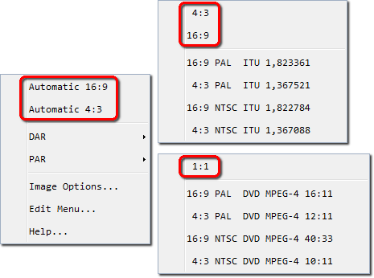

The two items **Automatic 16:9** and **Automatic 4:3** on the first menu level force StaxRip to assume a DAR of 16:9 or 4:3 for the source video. In most cases, one of these two settings should be sufficient to straighten out an incorrectly detected aspect ratio. In the **DAR** and **PAR** submenus we have more options to force 16:9, 4:3 or square pixels (1:1). If all else fails, we open the **Options** main menu and go to **Image > Aspect Ratio**. There in the two **Custom Source** fields we can enter any display AR or pixel AR.

The **Preview** function (**F5**) shows us the image in its final form, i.e. including cropping, resizing and considering the aspect ratio. If we see no more distortion there, we have chosen a suitable AR.

*What it is about the aspect ratio and the various abbreviations, we deal with in the background knowledge in the chapter [Anamorphic source video](https://encodingwissen.de/hintergrund/videobild/anamorph/quellvideo/).*

# Configure the destination file

**T**he second step on the way to the final movie file is to configure the target file. This includes choosing the container, including chapters and dynamic subtitles, and for 2-pass encoding, setting the final size.

## Configure the container

**I**n the **Target** section, StaxRip has already suggested a name for the target file, which we can customize to our liking. Then we select the [container format](https://encodingwissen.de/hintergrund/formatedschungel/container/) of our target file directly below with the right blue link.

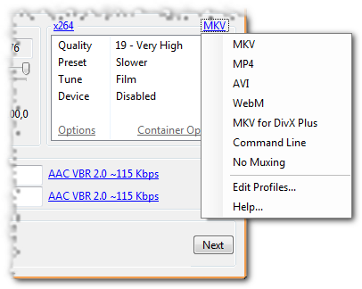

- **MKV** is the abbreviation of the Matroska container, the standard container for normal encodings.

- **MKV for DivX Plus** ensures that all encoding remains compatible with DivX Plus certification. This is only interesting if we have DivX Plus hardware for playback.

- **WebM** is the "Internet variant" of Matroska, which is limited to VP8/VP9 video and Vorbis or Opus audio.

- **MP4** chooses the container defined in the MPEG-4 standard. It supports some formats less than Matroska and is widely used on the web and in the Apple world.

- **AVI** can be interesting only if we need to support ancient playback hardware. But it also means that we have to live with massive limitations in the supported formats.

- **No Muxing** deactivates muxing, i.e. StaxRip only generates the finished single streams, which we can then find in the destination folder and process manually.

*Attention: When changing the container - whether automatically or manually - all settings for subtitle tracks etc. will be lost.*

To configure the container, i.e. include chapters and dynamic [subtitles](https://encodingwissen.de/hintergrund/formatedschungel/untertitel/), we click **Config Container** or **Container Configuration**, depending on which encoder is selected.

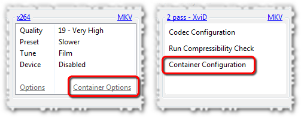

### Matroska

**T**he subtitles dialog for the Matroska container looks like this:

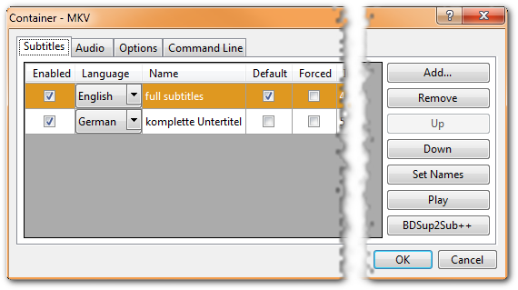

Using the **Add** button under Subtitles we load Blu-ray or Vobsub graphic subtitles or text subtitles in SubRip, Substation Alpha (SSA and ASS) or MPEG-4 Timed Text (TTXT) formats. For each track we can then select the language (**Language**) and name (**Name**) to be displayed in the player. On the **Options** tab we configure the remaining metadata.

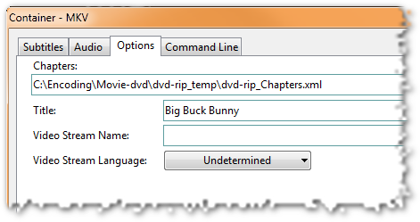

Under **Chapters** we load the chapter list. Normally this is in the simple Ogg format as a *.txt* file. However, we can also load Matroska's structured chapters (*.xml* file), even if StaxRip does not explicitly offer this option in the dialog.

**Video Stream Language** sets the language of the video track. Under **Video Stream Name** we can assign a name for the video track. Finally, **Title** defines the global title of the Matroska file. Of course, it makes sense to use this field for the movie title.

### MP4

**T**he dialog for the MP4 container looks almost the same as the one for Matroska. Only some details are missing, which are not possible in MP4. This is especially true for the subtitles. MP4 does not officially support graphic subtitles, but StaxRip does not complain if we load some anyway. Likewise, only simple chapter lists are allowed under **Chapters**, while Matroska's structured chapters are not.

### AVI

**A**VI? Why AVI? Who seriously wants to use AVI nowadays? ... Well, fine. The AVI format doesn't support chapters or dynamic subtitles and doesn't offer any other metadata. Accordingly, there is nothing to configure. AVI is also only compatible with the Xvid video encoder.

## Setting the target size

**F**or a [2-pass encoding](https://encodingwissen.de/codecs/encodingmethoden/) we need one last step to complete the configuration of the target file. For this we turn to the **Target** section in the main window.

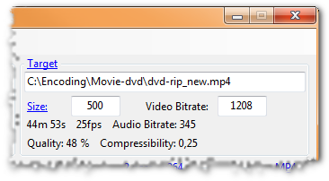

Here you can already see the suggested filename for the final movie. The file extension will be automatically adjusted for the selected container. If we have chosen 2-Pass as the encoding method, we set the size of the movie in **Size**. Either we select one of the available defaults by clicking on **Size** or we type in the MByte value ourselves. For 1-pass encoding, the unnecessary fields are hidden.

**N**ow all settings for the target file are done and we can take care of the audio track(s).

# Inserting audio tracks

**F**or Blu-ray and DVD backup, audio transcoding has become much less important since the finished movies are stored on spacious hard disks instead of tight silver discs. With HD encodings, the video track is so large that the audio size hardly matters. And DVD encodings are comparatively tiny overall. Simply muxing the original audio tracks unchanged is a very reasonable option - and qualitatively optimal at that.  

Nevertheless: Audio transcoding with StaxRip is hardly less flexible than manually with FFmpeg or BeSweet, just more inconvenient under certain circumstances. A set of profiles is available for typical transcoding, which is quite sufficient in most cases. If you like, you can also adjust the profiles to your personal preferences or add new ones. Then, even with exceptional audio conversions, it is possible to configure the entire backup process and run it as one long process without having to intervene again in between.

## Configure audio tracks

**I**n the **Audio** section of the StaxRip main window we add the audio tracks to our encoding. In the first line we enter the track that should be the first in the container and thus usually preferred during playback. Since StaxRip wants to save us as much work as possible, the program automatically searches for audio tracks that are likely to fit when opening the source video. Chances are, therefore, that we won't have to worry about loading the audio source files at all.

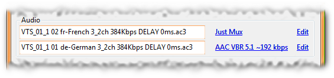

For each of the two audio tracks, StaxRip shows the source file, next to it as a link the name of the transcoding profile and on the far right the **Edit** link for adjusting the settings.

*StaxRip is limited to two audio tracks only in the main window. We can add more in the **Container Options** on the **Audio** tab. The configuration options are the same everywhere.*

We load the source file by double-clicking in the file name field. Clicking on the blue profile name then opens an audio menu with the list of available profiles.

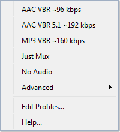

We decide on an [audio format](https://encodingwissen.de/hintergrund/formatedschungel/audiocodecs/) by selecting the appropriate profile from the menu. For example, to convert an original AC-3 to a high quality 6-channel HE-AAC track, we would take from the profile **AAC VBR 5.1 ~192 kbps**. The menu item **Just Mux** takes the source file unchanged into the encoding. The most typical case for this is an original audio track directly from the disc. But also manually transcoded files come into question. **No Audio** completely ignores the specified source file, as if we had never loaded it.

*If we include multiple audio tracks, the format does not have to be the same for both. For example, there is nothing wrong with using the original track for the important speech and converting the less important one to space-saving HE-AAC.*

**I**f none of the predefined profiles suits our needs, we simply select any of them and adjust the transcoding settings with the **Edit** link.

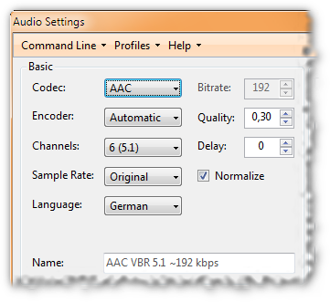

The screenshot shows the left side of the transcoding dialog. We leave the **Encoder** set to Automatic. StaxRip then selects BeSweet, eac3to or FFmpeg according to the source and destination format. Important settings are the desired **Codec**, the number of **Channels** and the encoder **Quality**. In the manual chapters on [BeSweet/BeLight](https://encodingwissen.de/praxis/handarbeit/audio/besweet/) and [FFmpeg](https://encodingwissen.de/praxis/handarbeit/audio/ffmpeg/) we have already dealt in detail with audio encoding. As a reminder, here is an overview of suitable settings for good quality.

| Format | Multikanal | Qualität                |
| ------ | ---------- | ----------------------- |
| AAC    | ✔️ Yes     | VBR between 0,2 and 0,3 |
| MP3    | ❌ No       | VBR between 0,6 and 0,8 |
| Vorbis | ✔️ Yes     | 0,2 to 0,3              |
| FLAC   | ✔️ Yes     | No adjustment necessary |

*Sensible quality setting for different encoders*

*AC-3 and DTS are uninteresting in the transcoding dialog, because we only accept these formats as unmodified original tracks. FLAC is only worthwhile with a lossless source (TrueHD, DTS-HD MA or PCM), uncompressed Waves are never useful in the final encoding.*

The **Language** and **Delay** fields are also important. Under **Language** we set the language of the audio track. **Delay** is the number of milliseconds by which the audio track must be shifted to the video track so that both run synchronously. The correct value is usually found in the filename and will be taken over automatically by StaxRip. Nevertheless, a control can not hurt. If we have already done the audio transcoding manually and have already taken the delay value into account there, the delay in StaxRip must always be set to **0**.

This brings us to the right side of the transcoding dialog, which looks slightly different depending on the encoder. The screenshot shows the variant for AC-3 to AAC.

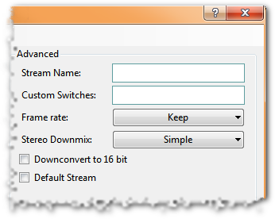

Here we can enter a short description of the audio track under **Stream Name**, which many players display when switching audio tracks. This is especially useful to mark special tracks, e.g. audio commentaries.

This completes the configuration of the audio track and we can close the dialog by clicking **OK**. If we don't want to transcode at all, but just want to use **Just Mux** to include an existing audio track unchanged, the configuration dialog also looks simpler.

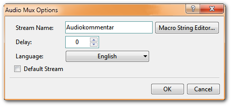

Only the metadata fields **Stream Name** and **Language** as well as the field for the **Delay** specification are present.

## Edit profiles

**U**sing the **Edit Profiles** item in the audio menu, we can create our own profiles for transcoding, which are then available in this menu.

In the profile dialog we create a new profile with the **Add** button. StaxRip offers us a list of existing profiles, from which we select one as the basis for the new profile. If we choose one directly from the audio menu, the transcoding dialog discussed above will appear. Normally this is quite sufficient. Only if we want to build an unusual configuration, we select the **Command Line** profile as the basis and then get the Expert dialog, in which we can directly change the command line for transcoding.

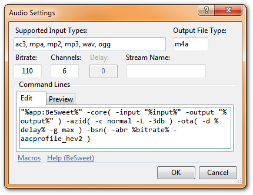

Under **Output File Type** we set the target format of the transcoding. We have to make sure manually that this is really what we create with our command line. Under **Bitrate** we enter the value that can be expected with our configuration under normal circumstances. This doesn't have to be an exact value, because after transcoding StaxRip calculates with the actual value anyway.

The large input field in the **Edit** tab is the place for the BeSweet, eac3to or FFmpeg command line. Which options are available and how the syntax is designed is discussed in the [BeSweet reference](https://brother-john.net/besweet-referenz.html), the [eac3to help](http://en.wikibooks.org/wiki/Eac3to) or the [FFmpeg doc](http://ffmpeg.org/ffmpeg.html).

A special feature in StaxRip are the macros, which are placeholders that are automatically replaced by StaxRip with the appropriate value for each encoding. E.g. `%delay%` stands for the delay value and `%input%` for the name of the source file. We can get a complete list of macros from the help (press **F1**).

This should be enough for the profile configuration. If you find this too cryptic, you should not worry too much about the expert dialog. The cases where the simple transcoding dialog is not sufficient are rare.

# Prepare the video

**I**n this chapter we will prepare the video for encoding. It depends on the type of encoding we are working with.

- With **Encoding in original resolution** we only cut away the black bars ([Cropping](https://encodingwissen.de/hintergrund/videobild/cropping/)) and leave the resolution otherwise unchanged. This is the normal case.
- For a **scaled encoding**, in addition to cropping, we reduce the original resolution (resizing) and convert [anamorphic sources](https://encodingwissen.de/hintergrund/videobild/anamorph/) to square pixels.

In addition, we configure the AviSynth filters and, in exceptional cases, include [burned-in subtitles](https://encodingwissen.de/praxis/handarbeit/untertitel/grafik/#eingebrannte-vobsubs).

## Crop image (Cropping)

**W**hen the source video is loaded, StaxRip performs automatic cropping by default. This works well, but it is not always perfect, so we better check it again. We reach the cropping dialog via **F4** or **Crop** in the main menu.

To correct the cropping values, we use the large slider to find a place with the brightest possible image edges, so that we can clearly see the transition between the image and the black bar. Then we move the mouse to that edge of the image that we want to change (do not click). There a light blue bar will appear (in the screenshot on the right edge), which activates this page. With the **plus** and **minus** keys on the numeric keypad (and only there) we can now cut off more or less pixels for the respective active page. Rotating the mouse wheel also works. We can also hold down **Ctrl** and the active and opposite edges will be cropped at the same time. With **Shift** we crop in larger steps.

The goal is to remove the black bars completely. If in doubt, it's better to remove one or two rows of pixels from the image than to leave one row of black pixels, because the hard transition from the image to the bar swallows up quite a bit of bitrate.

*For Blu-rays, remember the [Exception for vertical bars](https://encodingwissen.de/hintergrund/videobild/cropping/#blu-ray-cropping).*

In the status bar at the bottom of the window StaxRip provides us with all information about cropping.

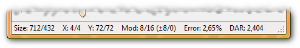

**Size** shows the resolution after cropping. Under **X** we see the number of pixel rows cut off at the left and right edges, and **Y** tells us the values for the top and bottom edges.

**Mod** shows the number by which the horizontal and vertical resolution is smoothly divisible after cropping. We have already dealt with this in more detail in the [chapter on target resolution](https://encodingwissen.de/hintergrund/videobild/zielaufloesung/#gueltige-aufloesungen). For scaled encodings the value is uninteresting, since we ensure mod-16 by subsequent scaling anyway.

**Error**, on the other hand, is only relevant for scaled encodings and is only displayed if the resize filter is active. The value stands for the aspect ratio error, i.e. the distortion caused by cropping and subsequent scaling to the target resolution. StaxRip accepts errors up to ±2% without complaint. Above that, we get a warning and a recommendation to adjust the resolution or crop values to reduce the error. 2% is quite cautious and in any case no problem. We can adjust the threshold for the warning under **Options > Image > Aspect Ratio > Maximum Aspect Ratio Error**.

**DAR** shows us the target aspect ratio. In addition to cropping, resizing - if active - is taken into account, as well as the shape of the pixels for anamorphic encodings. So the value gives us the aspect ratio of the final image as we will see it during playback.

## Scale image (Resizing)

**A**fter cropping, we close the cropping dialog and select the target resolution via the slider under **Resize** - of course only if we do not keep the original resolution and have a good reason for the loss of detail by reducing the image. Usually this is only the case for 2-pass encoding with an extremely tight target size.

So we choose a resolution that fits the encoding. We have already looked at the relationship between resolution and quality in more detail in the [chapter on target resolution](https://encodingwissen.de/hintergrund/videobild/zielaufloesung/#aufloesung-und-qualitaet-im-2-pass). In addition, there is the desire for an aspect ratio error that is as small as possible. StaxRip displays this error at **Error**. The value is the same as in the **Crop** dialog.

## Configure filters

**A**t the end of the "image processing" we still have to configure the AviSynth filters. This is the responsibility of the **Filters** section to the left of the resolution slider. There we see a list of filters that are applied to the video in the order they appear in the list. With the mouse we can drag each filter to a different position. The checkbox in front of each line toggles the filter on and off.

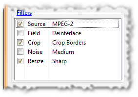

The **Resize** entry controls the resizing filter for scaled encodings. For original resolution encodings, the filter must be disabled, i.e. the **Resize** entry unchecked. With a right click we can select different variants. **Bilinear** has a blurring effect, which is useful for extremely compressed encodings. Through **Bicubic**, **Lanczos**, and **Lanczos4**, the image becomes sharper and less compressible. The most common filter is clearly **Lanczos**.

**Source** and **Crop** should be self-explanatory. The two entries take care of loading the source video and cropping. Of course, both must always be checked. DVD and Blu-ray sources need different source filters. StaxRip automatically takes care of selecting the right one.

**Field** is only interesting for interlaced video, i.e. when we see comb artifacts in the video, as we briefly addressed in the [DGIndex chapter](https://encodingwissen.de/praxis/handarbeit/quelle/vobs-indexieren/). In this case, we check the box to enable the deinterlacer. For progressive videos **Field** must never be checked, because an unnecessarily activated deinterlacer always harms the picture quality.

*Unfortunately, there is no easy remedy for interlacing. Interlaced is a disgusting remnant from the analog primeval times and should have died out with the current HD formats at the latest. It's best to think of interlaced as severe damage to the source video that needs to be repaired with a lot of effort and precisely tuned filters. If you deal a lot with interlaced video and care about quality, you must deal with the subject intensively. For lack of own experience I can't give any tips.*

If we are in the unfortunate situation of needing burned-in subtitles, we use the **Tools > Advanced > Hardcoded Subtitle** (**Ctrl+H**) menu to set the [IDX file created and edited with VSRip](https://encodingwissen.de/praxis/handarbeit/untertitel/grafik/#eingebrannte-vobsubs) or a ready-made SubRip file. Dynamic subtitles are not of interest here, because we included them in the container when configuring the destination file. Burned-in subtitles get a filter entry in the list. Whether we move them before or after the **Resize** filter is mainly a matter of taste. Using the **Preview** function (**F5**) we test what looks best.

Via a right click and **Add** we can choose from a whole list of additional filters. Filtering is always a fine line between improved image and broken filtered garbage. That's why we must never get carried away with adding filters by feel. If we don't want to go into detail about which filters in which combination and configuration do a specific film good - and that involves a lot of testing - we'd better leave it alone altogether. The risk of significantly degrading the image quality is too great.

# Configuring the video encoder

**T**he start of encoding is now imminent. We still have to configure the [Videoencoder](https://encodingwissen.de/hintergrund/formatedschungel/videocodecs/). For 2-pass encodings, it is also useful to do a compression test, which gives us a really useful indication of quality.

Using the video encoder link in the configuration section on the right side of the main StaxRip window, we select the video codec we want to use. Depending on the [Encoding Method](https://encodingwissen.de/codecs/encodingmethoden/), we will need a profile directly from the first level of the menu (1 pass) or from the **2 pass** submenu.

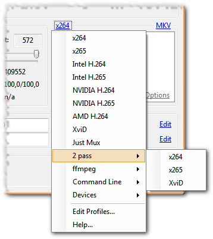

If the finished movie has to hit a given file size as closely as possible, we need two encoding passes. If we are mainly interested in quality, without needing to hit a given size, a single encoding pass will suffice.

To reiterate, because the legend persists: 2-pass is *not* better in quality than 1-pass. Two passes are only useful to achieve a fixed target size. And one target size only makes sense if external circumstances force us to do so.

## x264-Configuration

**x**264 we can configure very comfortably directly in the StaxRip main window. We first select one of the 1-pass CRF or 2-pass profiles from the encoder menu depending on the encoding method. In the box directly below, StaxRip offers us all the necessary options.

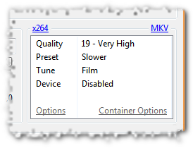

By clicking on **Quality**, we set the desired CRF value in the 1-pass. The choices in the menu range from 18 to 26, which should be enough for any quality requirement. My default CRF is 19 for DVDs and 20 for Blu-rays. DVDs get a little more quality because they have the smaller resolution. Of course, if the video is scaled to full screen when you watch it, this will also enlarge any encoding artifacts and make them more visible.

The two items **Preset** and **Tune** map one-to-one to the [template system of x264](https://encodingwissen.de/codecs/x264/konfiguration/#x264-vorlagensystem). Under **Preset** we control the speed of encoding - the slower, the smaller the file (1-pass) or the higher the quality (2-pass). **Slow** is a good compromise even for slow computers, but **Slower** or **Very Slow** are more recommended. For comparison: my old Athlon processor from 2009 (4 cores, 3 GHz) passes flawlessly as a "slow computer". It encodes the full DVD resolution with the **Slow** preset in about real time.

**Tune** tunes the x264 configuration to specific types of source material or other special requirements. The default tune is **Film**, which we use for regular theatrical movies and also 3D animation à la Pixar. **Animation** is a good choice for cartoon material, and with **Grain** we can encode even heavily noisy movies without the noise turning into nasty artifact garbage. The price, however, is a significantly higher bitrate requirement, so be careful in 2-pass when the target size is tight.

Finally, with **Device** we can adjust the encoding to the requirements of specific hardware players. We don't need to pay attention to more details to configure x264. On the contrary, if we don't have a good idea of what individual options do, we'd better leave manual settings alone. The risk of turning the quality down instead of up is too great.

**E**ven if we want to do it ourselves, it makes sense to use the templates to set a configuration that comes close to what we want. For the changes that are then still necessary, we call up the configuration dialog by clicking on the **Options** link. The [x264 reference](https://encodingwissen.de/codecs/x264/referenz/) from the codec knowledge is best suited to explain the dialog, because StaxRip takes the mapping between CLI parameters and GUI option from us in both directions.

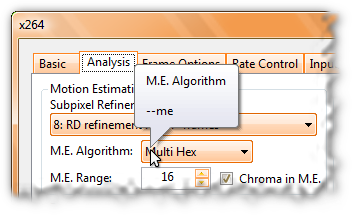

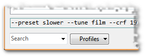

If we move the mouse to a setting in the configuration dialog and leave it there for a moment, a speech bubble opens with the corresponding parameter for the command line. The other way around we can search for a specific parameter in the lower left corner of the dialog with the **Search** combo box or expand the list and select one directly. StaxRip then jumps to the appropriate place in the dialog.

## Compression test and quality tuning

**T**his section is relevant only for 2-pass encoding. The compression test is the only means of obtaining a reasonably reliable quality indicator that takes into account the complexity of each movie. The disadvantage is that it is not a pure calculation, but a piece of the movie (5% by default) has to be encoded. This, of course, takes a few minutes, but we should allow ourselves that. Because even with some experience, the pi by thumb technique we have used so far to set target size, resolution, etc. can fail. It is better to invest a few minutes for the compression test than to end up with poor quality and have to encode the whole movie again.

The compression test is started via the corresponding entry in the configuration list.

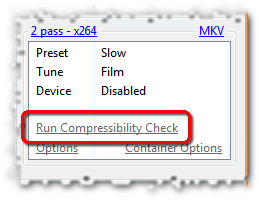

A click on **Run Compressibility Check** executes the test, and StaxRip is reduced to a status window. After the test we take a look at the **Target** section.

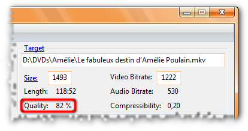

Under **Quality** there is now a percentage value that was determined with the test. The reasonable range is from 50 to 90 percent for x264 and from 60 to 90 percent for Xvid.

If the percentage is too low, we must either make room (smaller audio tracks, higher target size) or reduce the resolution. If the values are too high, we can conversely increase the resolution or "waste" space. Maybe it is enough for the unchanged AC-3 or an additional audio track after all. If you still encode to CDs (poor sod!), in the happiest case you can even save a disc. Taking another look at the [chapter on target resolution](https://encodingwissen.de/hintergrund/videobild/zielaufloesung/#aufloesung-und-qualitaet-im-2-pass) can't hurt at this point.

*100% stands approximately for the saturation limit of the encoder. If we start an encoding with a quality value of around 100% or even higher, we can expect the target file to be smaller than planned.*

## Start encoding

**A**ll settings are now done, the compcheck value of the 2-pass is within the reasonable range, especially the container configuration is checked one last time - then we are ready for the decisive click.

It may take several clicks, because first we click **Next** at the bottom right of the StaxRip window until the job list window appears.

This is where the final click on the **Start** button happens. After that, we can sit back and put on coffee.

## About this tutorial

- Authored by Brother John for [encodingwissen.de](https://encodingwissen.de).

- [Licensed under Creative Commons](https://encodingwissen.de/info)

- Translated with the translation tool [deepl](https://www.deepl.com/translator).

- Edited by stax76 using the [MarkText](https://github.com/marktext/marktext) editor.
